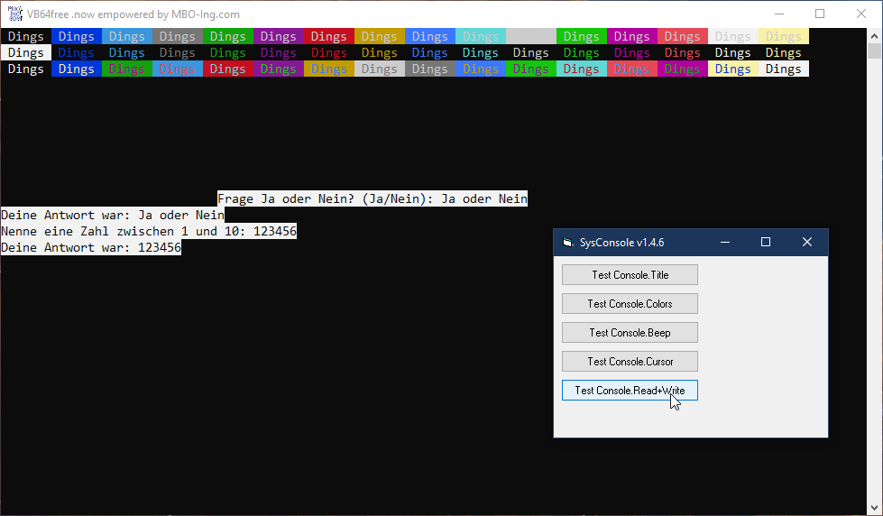

# Sys_Console  
## class Console with unicode-support very similar to .net System.Console  

 

Project started around Aug.2006.  
Console class with unicode support and about 90% of the functionality of the class .net System.Console  
Works in VBC/VB6/VBA7 x86+x64 tested with Excel 2016 x64  

